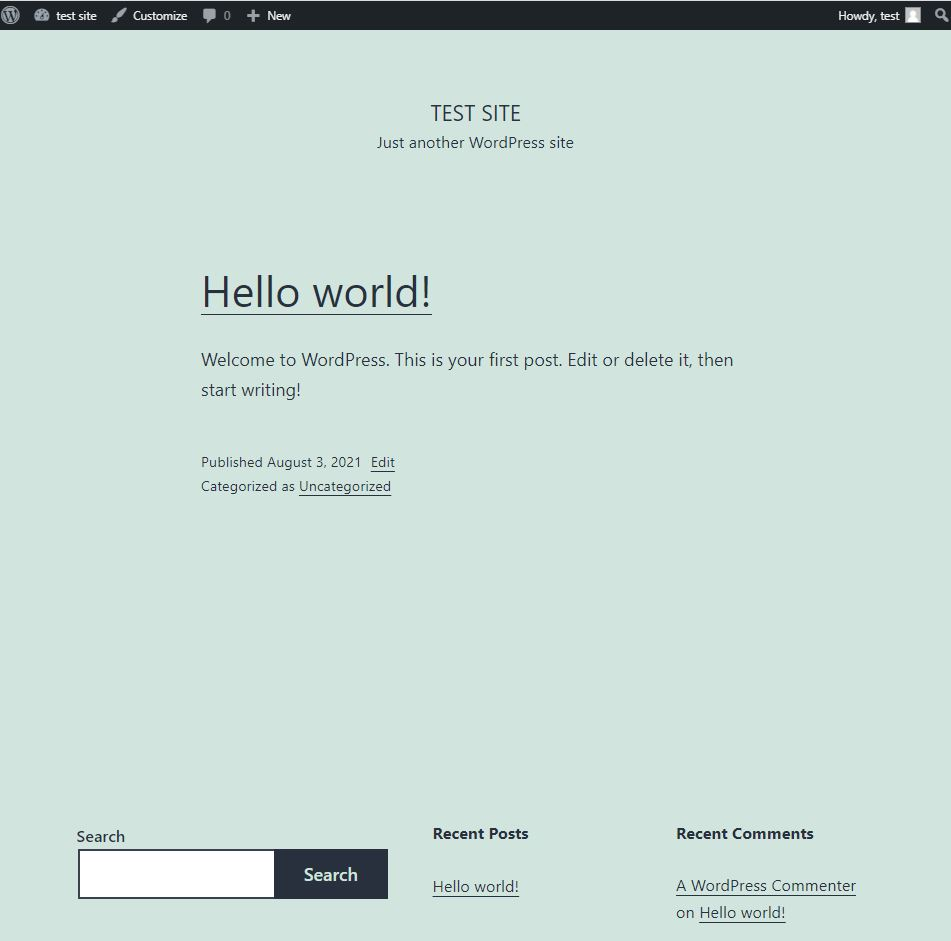

# Start up the WordPress container

First, pull the WordPress official docker iamge.

> `docker pull wordpress`{{execute}}

Start the WordPress container.

> `docker run -e WORDPRESS_DB_USER=wordpress -e WORDPRESS_DB_PASSWORD=12345 -e WORDPRESS_DB_HOST=mysql:3306 --name wordpress --network=wordpress-network -p 10080:80 -v /tmp/html/:/var/www/html -d wordpress`{{execute}}

When you start the WordPress image, you can adjust the configuration of the WordPress by passing one or more environment variables
* `-e WORDPRESS_DB_HOST=mysql:3306`: Specify the hostname (`mysql`) and the port (`3306`) of the database server for wordpress to store the data.
* `-e WORDPRESS_DB_USER`: Set the mysql database user name.
* `-e WORDPRESS_DB_PASSWORD`: Set the mysql database password.

In addition, the WordPress container takes the following parameters:
* `–-name wordpress`: Set the container's name.
* `--network=wordpress-network`: Connect the wordpress container to the specified docker network.
* `-p 10080:80`: Tells Docker to pass connections from your host's port 10080 to the containers internal port 80.
* `-v "$PWD/html":/var/www/html` : Sets the WordPress files to be accessible from outside the container (`/tmp/html`). The volume files will remain even if the container was removed.
* `-d`: Makes the container run on background.
* `wordpress`: The name of the image to be run.

Visit https://hub.docker.com/_/wordpress to understand more about the parameters/environment variables related to the official docker WordPress image.

Check that the WordPress container is running.

> `docker ps`{{execute}}

Check the logs of the WordPress container to verify that there is no error.

> `docker logs wordpress`{{execute}}

Access your WordPress application at localhost:10080
- In Katacoda, visit the WordPress website with the following URL: 
https://[[HOST_SUBDOMAIN]]-10080-[[KATACODA_HOST]].environments.katacoda.com/

Follow the setup instruction after clicking the above link. After selecting the language and completing the website setup process, you will be redirected to the WordPress admin portal.

Click your sitename on the top left and click `visit site` to view the WordPress website.

