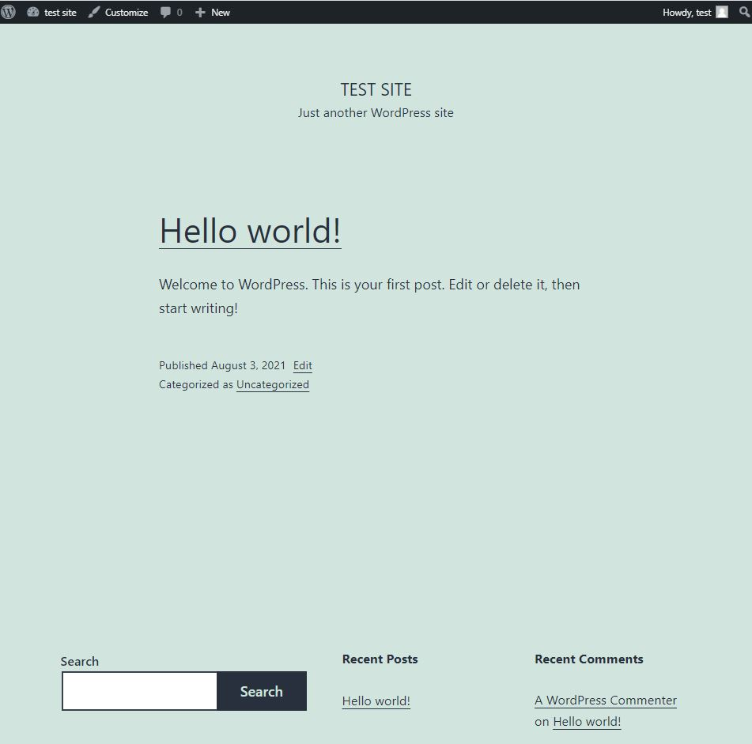

# Docker Compose

Instead of starting up the individual containers, we may start up the WordPress application by using "Docker Compose", a tool for defining and running multi-container Docker applications. With Compose, you use a YAML file to configure your application's services. 

Create the file `docker-compose.yml` as follows. The configuration file will startup the WordPress and MySQL containers. The two containers can communicate through the docker network. Also, the port `80` in the WordPress application is mapped to the host port `20080`.

<pre class="file" data-filename="docker-compose.yml" data-target="replace">

version: '3'

services:
   db:
     image: mysql:8
     volumes:
       - db_data:/var/lib/mysql
     restart: always
     environment:
       MYSQL_ROOT_PASSWORD: somewordpress
       MYSQL_DATABASE: wordpress
       MYSQL_USER: wordpress
       MYSQL_PASSWORD: wordpress

   wordpress:
     depends_on:
       - db
     image: wordpress:latest
     ports:
       - "20080:80"
     restart: always
     environment:
       WORDPRESS_DB_HOST: db:3306
       WORDPRESS_DB_USER: wordpress
       WORDPRESS_DB_PASSWORD: wordpress
volumes:
    db_data:
</pre>

Wait for the file to be saved.

Execute the following command to start up the containers.

> `docker-compose up`{{execute}}

After the containers have been started up and initialized, you may access your WordPress application at `localhost:20080`.

In Katacoda, visit the WordPress website: 

https://[[HOST_SUBDOMAIN]]-20080-[[KATACODA_HOST]].environments.katacoda.com/

Press `Ctrl+C` in the terminal running docker-compose to stop your containers.

