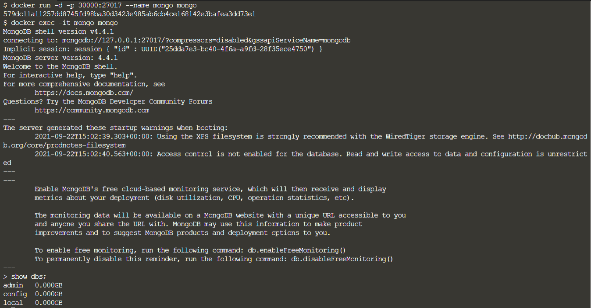

# Setup

--------------------------------

## Running MongoDB with Docker

To launch the MongoDB Server using Docker, execute in command prompt.
> `docker run -d -p 30000:27017 --name mongo mongo`{{execute}}

Launch the mongo shell.
> `docker exec -it mongo mongo`{{execute}}

Show the available databases.
> `show dbs;`{{execute}}

## Install MongoDB locally
You can also install MongoDB in your host's computer.
https://docs.mongodb.com/manual/administration/install-community/

 
