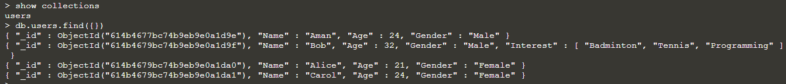
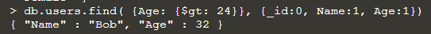

## MongoDB CRUD

Create a "demo" database and switch to it:
> `use demo`{{execute}}

Insert a number of documents into "users" collection.

`db.users.insertOne({ "Name" : "Aman", Age : 24, Gender : "Male" })`{{execute}}

```
db.users.insertMany(
[
  {
        "Name" : "Bob",
        "Age" : 32,
        "Gender" : "Male",
	"Interest": ["Badminton", "Tennis", "Programming"]
    },
    {
        "Name" : "Alice",
        "Age" : 21,
        "Gender" : "Female"
    },
    {
        "Name" : "Carol",
        "Age" : 24,
        "Gender" : "Female"
    }
 ]
)
```{{execute}}

Check that the **users** collection exists.
> `show collections`{{execute}}

To retrieve all users in users collection,
> `db.users.find({})`{{execute}}



You can also specify query criteria to only retrieve a subset of the documents and specify the columns to be projected. E.g. to retrieve all documents with age > 24 and show only the **Name** and **Age** attributes.
> `db.users.find( {Age: {$gt: 24}}, {_id:0, Name:1, Age:1})`{{execute}}



To update Bob’s document and set the “Age” attribute to be 35.
> `db.users.updateOne({"Name":"Bob"}, {$set: {"Age": 35}} )`{{execute}}

To delete Carol’s document.
> `db.users.deleteOne({"Name":"Carol"})`{{execute}}


The following command removes the users document and drop the demo database.
> `db.users.remove({})`{{execute}}
> 
> `db.dropDatabase()`{{execute}}

Exit the mongo connection session:
> `exit`{{execute}}

<br/>
