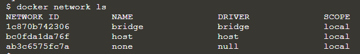
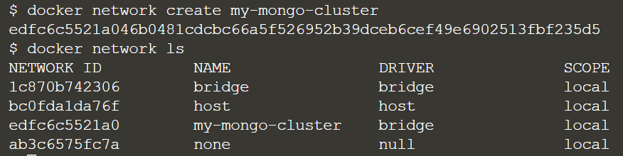
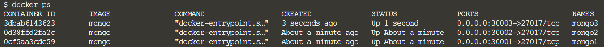

# MongoDB Replication

-----------------------------------------

## Setting up the replica set

Check that all the networks are currently on your system.
> `docker network ls`{{execute}}



Add a new network called "my-mongo-cluster".
> `docker network create my-mongo-cluster`{{execute}}
>
> `docker network ls`{{execute}}



To launch the mongo DB daemon process while adding this mongod instance to the replica set named “my-mongo-set”, we may use the command mongod `--replSet my-mongo-set`.

To run the `mongod` using `docker`,
> `docker run -d -p 30001:27017 --name mongo1 --net my-mongo-cluster mongo mongod --replSet my-mongo-set`{{execute}}

Similarly, launch two other mongoDB instances with different host port mapping.
> `docker run -d -p 30002:27017 --name mongo2 --net my-mongo-cluster mongo mongod --replSet my-mongo-set`{{execute}}
> 
> `docker run -d -p 30003:27017 --name mongo3 --net my-mongo-cluster mongo mongod --replSet my-mongo-set`{{execute}}

Check the three running processes:
> `docker ps`{{execute}}



Connect to the mongo shell in any of the containers and define the DB cluster configuration.
> `docker exec -it mongo1 mongo`{{execute}}

Define the DB cluster configuration:

```
config = {
  	"_id" : "my-mongo-set",
  	"members" : [{"_id" : 0,"host":"mongo1:27017"}, 
			{"_id":1, "host":"mongo2:27017"}, 
		{"_id" : 2,"host" : "mongo3:27017"} ]
  }
```{{execute}}

<br/>
