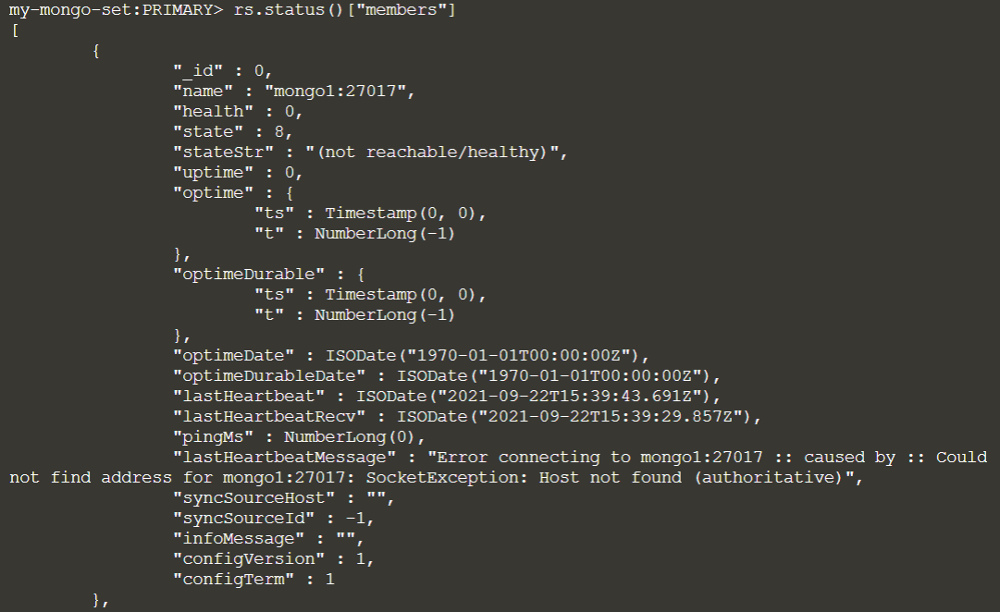
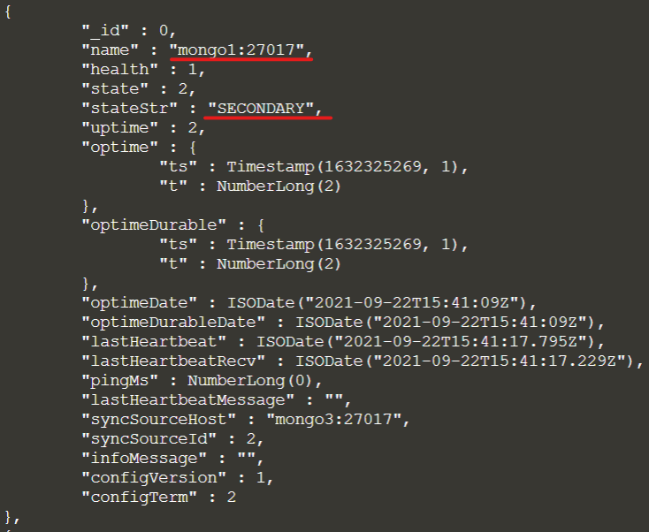
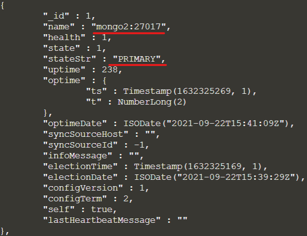

## Database server failure

In the host’s command prompt, stop the primary DB instance.
> `docker stop mongo1`{{execute}}

Verify if one of the secondary database server become the primary.
> `docker exec -it mongo2 mongo`{{execute}}
> 
> `exit`{{execute}}
> 
> `docker exec -it mongo3 mongo`{{execute}}
> 
> `exit`{{execute}}

Execute the new primary database server:
> `docker exec -it mongo2 mongo`{{execute}}

View the status of the replica set.
> `rs.status()["members"]`{{execute}}

Check the status of members with “_id” = 0. You can see error "Error connecting to mongo1:27017..." in the status.

Exit the mongodb connection session:
> `exit`{{execute}}

In the host’s command prompt, restart mongo1 container.
> `docker start mongo1`{{execute}}

Inside the container’s mongo shell, check the replica set’s status again. You can see **mongo2** has become primary, while **mongo1** has become secondary.
> `docker exec -it mongo2 mongo`{{execute}}
>
> `rs.status()["members"]`{{execute}}

Exit the mongodb connection session again:
> `exit`{{execute}}

Stop and remove the various containers after you have completed the exercises.
> `docker rm -f mongo1 mongo2 mongo3`{{execute}}

 
