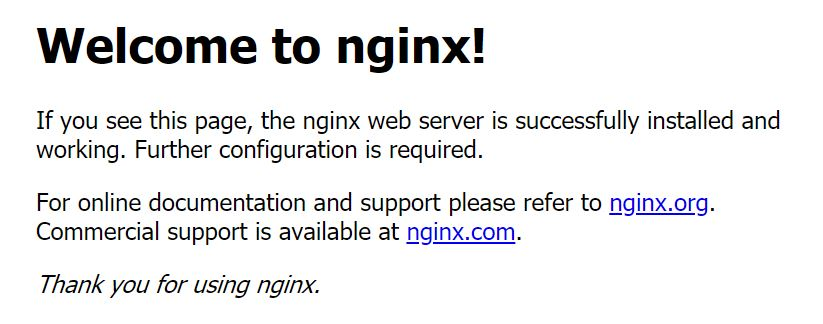

 # Port mapping 

By default, when you create or run a container using docker create or docker run, it does not publish any of its ports to the outside world. To make a port available to services outside of Docker, or to Docker containers which are not connected to the container’s network, use the `-p` flag. This will create a firewall rule which maps a container port to a port on the Docker host to the outside world. 

Execute the following command in terminal T1 to create a container named "c0", where the `-p` option will map the port 80 in the nginx container to the host port 20080.

> <span align="left" style="color:#FFF;background:#555;font:Courier New; font-size: 90%; padding-left: 5px; padding-right: 5px; padding-top: 5px; padding-bottom: 5px;"> docker run --name c0 -p 20080:80 nginx:1.21 </span>

In terminal T2, check the status of the running nginx container.

> <span align="left" style="color:#FFF;background:#555;font:Courier New; font-size: 90%; padding-left: 5px; padding-right: 5px; padding-top: 5px; padding-bottom: 5px;"> docker ps </span>

To verify the port mapping status, check that the `PORTS` column for the nginx container is `0.0.0.0:20080->80/tcp`. 

In terminal T2, visit localhost at port 20080 to access the default website in Nginx.

> <span align="left" style="color:#FFF;background:#555;font:Courier New; font-size: 90%; padding-left: 5px; padding-right: 5px; padding-top: 5px; padding-bottom: 5px;"> curl localhost:20080 </span>

Sample output:

```
$ curl localhost:20080
<!DOCTYPE html>
<html>
<head>
<title>Welcome to nginx!</title>
<style>
    body {
    width: 35em;
    margin: 0 auto;
    font-family: Tahoma, Verdana, Arial, sans-serif;
    }
</style>
</head>
<body>
<h1>Welcome to nginx!</h1>
<p>If you see this page, the nginx web server is successfully installed and
working. Further configuration is required.</p>

<p>For online documentation and support please refer to
<a href="http://nginx.org/">nginx.org</a>.<br/>
Commercial support is available at
<a href="http://nginx.com/">nginx.com</a>.</p>

<p><em>Thank you for using nginx.</em></p>
</body>
</html>
```

Visit `http://localhost:20080` in your browser (if you are running the lab in your own computer).

In katacoda, you may visit 

https://[[HOST_SUBDOMAIN]]-20080-[[KATACODA_HOST]].environments.katacoda.com/ .

Sample output:



<br/>
